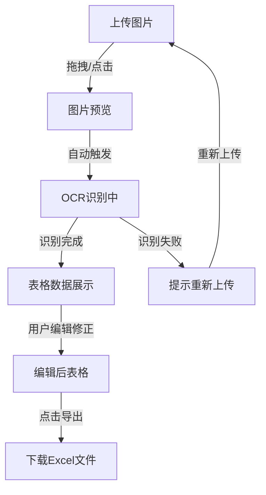

## 1. 产品概述

表格图片转Excel工具 —— 一款纯前端的在线工具，用户上传包含表格的图片，通过OCR技术自动识别表格内容，并支持编辑修正后导出为Excel文件下载。

- 目标用户：需要将纸质表格、截图表格数字化为Excel的办公人员、学生、数据分析师
- 核心价值：无需安装软件、无需注册登录、一键识别导出、支持编辑修正

## 2. 核心功能

### 2.1 用户角色

无需角色区分，所有用户均可直接使用全部功能。

### 2.2 功能模块

1. **主页**：图片上传区、图片预览、OCR识别、表格编辑、Excel下载

### 2.3 页面详情

| 页面名称 | 模块名称 | 功能描述 |
|----------|----------|----------|
| 主页 | 图片上传区 | 支持拖拽上传或点击选择图片，支持JPG/PNG/BMP格式，限制10MB |
| 主页 | 图片预览 | 显示上传的原始图片，支持缩放查看 |
| 主页 | OCR识别 | 使用Tesseract.js进行文字识别，显示识别进度，自动解析表格结构 |
| 主页 | 表格编辑区 | 以可编辑表格形式展示识别结果，支持单元格编辑、增删行列 |
| 主页 | Excel导出 | 一键将编辑后的表格数据生成.xlsx文件并下载 |
| 主页 | 操作提示 | 引导用户完成上传→识别→编辑→导出的完整流程 |

## 3. 核心流程

1. 用户进入主页，看到上传区域和操作引导
2. 用户拖拽或点击上传包含表格的图片
3. 系统自动开始OCR识别，显示识别进度条
4. 识别完成后，将结果以可编辑表格形式展示
5. 用户可编辑修正识别结果中的错误
6. 用户点击"导出Excel"按钮，系统生成.xlsx文件并触发下载

## 4. 用户界面设计

### 4.1 设计风格

- **主色调**：深灰白底(#fafafa) + 翡翠绿主色(#10b981) + 深灰文字(#1a1a2e)
- **按钮风格**：圆角按钮，主按钮翡翠绿实色，次按钮描边样式，hover时微妙阴影
- **字体**：标题使用 "DM Sans" 现代几何无衬线体，正文使用系统字体栈
- **布局风格**：单页应用，左右分栏（左图右表），顶部导航栏
- **图标风格**：线性图标（lucide-react），2px描边，与文字同色

### 4.2 页面设计概览

| 页面名称 | 模块名称 | UI元素 |
|----------|----------|--------|
| 主页 | 顶部导航 | Logo + 工具名称，简洁导航栏 |
| 主页 | 上传区域 | 虚线边框拖拽区，上传图标，支持格式提示，拖入时边框变色动画 |
| 主页 | 图片预览 | 左侧面板，图片居中展示，底部显示文件信息 |
| 主页 | 识别进度 | 进度条 + 百分比文字 + 识别状态文字 |
| 主页 | 表格编辑 | 右侧面板，可编辑单元格，斑马纹行，hover高亮行，单元格聚焦边框 |
| 主页 | 工具栏 | 增加行/列、删除行/列、清空数据、导出Excel按钮 |
| 主页 | 空状态 | 未上传时显示引导步骤卡片 |

### 4.3 响应式

- 桌面优先，左右分栏布局
- 平板端上下堆叠布局
- 移动端单列布局，图片和表格上下排列

### 4.4 交互细节

- 拖拽上传时边框动画变色
- OCR识别时显示脉冲动画进度条
- 表格单元格双击进入编辑模式
- 导出按钮点击后有成功提示动画
- 页面加载时有淡入动画
