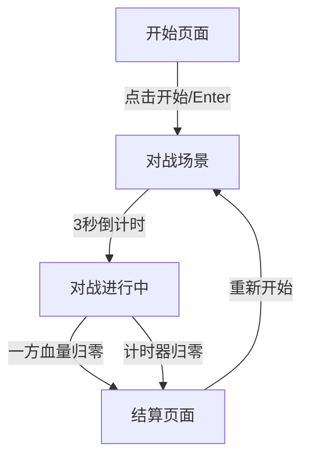

## 1. 产品概述

像素风机甲对战小游戏 —— 一款复古像素风格的本地双人对战格斗游戏。两名玩家各操控一台机甲，在竞技场中通过移动、攻击、防御等操作进行对战，先击破对方血量者获胜。

- 目标用户：喜欢复古像素风、本地双人对战的休闲玩家
- 核心价值：简单易上手、视觉风格鲜明、对战节奏紧凑

## 2. 核心功能

### 2.1 用户角色

| 角色 | 操作方式 | 核心能力 |
|------|----------|----------|
| 玩家1（蓝方机甲） | WASD + F(攻击) + G(防御) | 移动、攻击、防御、特殊技能 |
| 玩家2（红方机甲） | 方向键 + J(攻击) + K(防御) | 移动、攻击、防御、特殊技能 |

### 2.2 功能模块

1. **对战场景页面**：竞技场背景、双机甲角色、血量条、计时器、操作提示
2. **开始/结算页面**：游戏标题、开始按钮、胜负结果、重新开始

### 2.3 页面详情

| 页面名称 | 模块名称 | 功能描述 |
|----------|----------|----------|
| 开始页面 | 标题动画 | 像素风标题闪烁动画，复古CRT扫描线效果 |
| 开始页面 | 操作说明 | 展示双方操控键位 |
| 开始页面 | 开始按钮 | 点击或按Enter开始游戏 |
| 对战场景 | 竞技场背景 | 像素风城市废墟/竞技场地面+远景 |
| 对战场景 | 机甲角色 | 两台像素机甲，含待机/移动/攻击/防御/受击动画 |
| 对战场景 | 血量条 | 双方血量条，受击时闪烁+减少动画 |
| 对战场景 | 能量条 | 攻击消耗能量，能量自动恢复 |
| 对战场景 | 计时器 | 99秒倒计时，时间到血多者胜 |
| 对战场景 | 命中特效 | 攻击命中时的像素火花/爆炸特效 |
| 结算页面 | 胜负判定 | 显示获胜方，播放胜利/失败动画 |
| 结算页面 | 重新开始 | 按钮或按键重新开始 |

## 3. 核心流程

1. 玩家进入开始页面，查看操作说明
2. 点击"开始对战"或按Enter进入对战场景
3. 双方机甲在竞技场中出现，倒计时3秒后开始
4. 玩家操控机甲移动、攻击、防御进行对战
5. 一方血量归零或时间结束，进入结算页面
6. 结算页面显示胜负，可选择重新开始

## 4. 用户界面设计

### 4.1 设计风格

- **主色调**：深蓝黑底色(#0a0a1a) + 霓虹蓝(#00d4ff) + 霓虹红(#ff3366) + 霓虹绿(#00ff88)
- **按钮风格**：像素风3D凸起按钮，hover时发光
- **字体**：像素风字体 "Press Start 2P"，标题16px，正文8px
- **布局风格**：全屏Canvas游戏画面 + 顶部HUD叠加层
- **图标/像素风格**：8-bit像素图标，CRT扫描线叠加，暗角效果

### 4.2 页面设计概览

| 页面名称 | 模块名称 | UI元素 |
|----------|----------|--------|
| 开始页面 | 标题动画 | 像素风大标题，霓虹发光效果，CRT扫描线 |
| 开始页面 | 操作说明 | 像素风键位图标，蓝/红双色区分 |
| 开始页面 | 开始按钮 | 像素3D按钮，闪烁提示 |
| 对战场景 | 竞技场 | 像素风地面砖块，远景建筑剪影，星空背景 |
| 对战场景 | 机甲角色 | 32x48像素精灵，4帧待机动画，3帧攻击动画 |
| 对战场景 | HUD | 顶部血量条+能量条+计时器，像素风边框 |
| 对战场景 | 特效 | 命中火花粒子，防御闪光，受击震动 |
| 结算页面 | 胜负文字 | 大号像素文字，胜方颜色发光 |
| 结算页面 | 重开按钮 | 像素3D按钮 |

### 4.3 响应式

- 桌面优先，Canvas自适应窗口大小
- 游戏逻辑基于虚拟分辨率(800x450)，等比缩放
- 支持全屏模式

### 4.4 游戏机制设计

**机甲属性：**
- 血量(HP)：100
- 能量(EP)：100，攻击消耗20，防御消耗10/秒，自动恢复5/秒
- 移动速度：3像素/帧
- 攻击伤害：普通攻击10，特殊攻击25(消耗50能量)
- 攻击范围：40像素
- 攻击冷却：普通0.5秒，特殊1.5秒

**防御机制：**
- 按住防御键进入防御姿态，减免70%伤害
- 防御时无法移动和攻击
- 持续消耗能量

**胜负判定：**
- 一方HP归零 → 对方获胜
- 99秒倒计时结束 → HP多者获胜
- HP相同 → 平局
