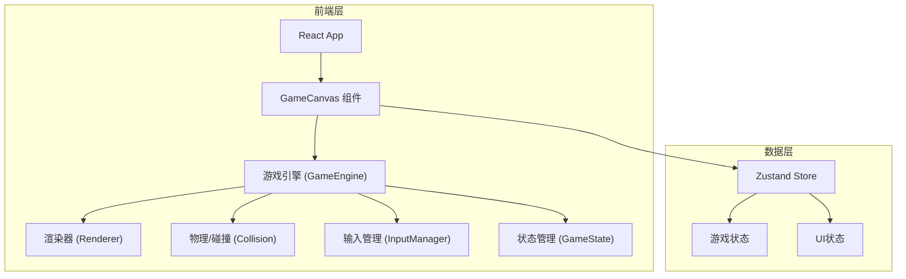

## 1. 架构设计



## 2. 技术说明

- 前端：React@18 + TypeScript + Tailwind CSS + Vite
- 初始化工具：vite-init
- 游戏渲染：HTML5 Canvas 2D
- 状态管理：Zustand
- 后端：无（纯前端项目）
- 数据库：无

## 3. 路由定义

| 路由 | 用途 |
|------|------|
| / | 游戏主页面（包含开始/对战/结算三个阶段） |

## 4. 核心模块设计

### 4.1 游戏引擎 (GameEngine)

负责游戏主循环，每帧执行：
1. 处理输入
2. 更新游戏状态（移动、攻击判定、碰撞检测）
3. 渲染画面

### 4.2 精灵系统 (SpriteSystem)

- 使用Canvas绘制像素精灵
- 精灵数据以二维数组存储（颜色索引）
- 支持帧动画切换（待机/移动/攻击/防御/受击）

### 4.3 碰撞检测 (Collision)

- AABB矩形碰撞检测
- 攻击判定：攻击方攻击框与被攻击方碰撞框重叠

### 4.4 输入管理 (InputManager)

- 键盘事件监听
- 双人键位映射
- 按键状态追踪（按下/释放）

### 4.5 粒子特效 (ParticleSystem)

- 命中火花粒子
- 防御闪光
- 胜利烟花

## 5. 项目文件结构

```
src/
├── components/
│   ├── GameCanvas.tsx       # Canvas容器组件
│   ├── HUD.tsx              # 血量条/能量条/计时器
│   ├── StartScreen.tsx      # 开始页面
│   └── ResultScreen.tsx     # 结算页面
├── game/
│   ├── engine.ts            # 游戏主循环
│   ├── renderer.ts          # Canvas渲染器
│   ├── input.ts             # 输入管理
│   ├── collision.ts         # 碰撞检测
│   ├── particles.ts         # 粒子系统
│   ├── sprites.ts           # 精灵数据与绘制
│   └── types.ts             # 游戏类型定义
├── store/
│   └── gameStore.ts         # Zustand游戏状态
├── pages/
│   └── GamePage.tsx         # 游戏主页面
├── App.tsx
└── main.tsx
```

## 6. 精灵素材方案

所有精灵素材通过代码绘制（Canvas像素点阵），无需外部图片文件：

- **蓝方机甲**：32x48像素，主色#00d4ff，深色#0066aa
- **红方机甲**：32x48像素，主色#ff3366，深色#aa1144
- **竞技场地面**：64x64像素砖块瓦片
- **背景建筑**：远景剪影，暗色调
- **特效帧**：火花/爆炸8x8像素粒子

精灵帧定义：
- 待机：4帧循环
- 移动：4帧循环
- 攻击：3帧（前摇/命中/后摇）
- 防御：2帧（举盾/持续）
- 受击：2帧（后退/恢复）
