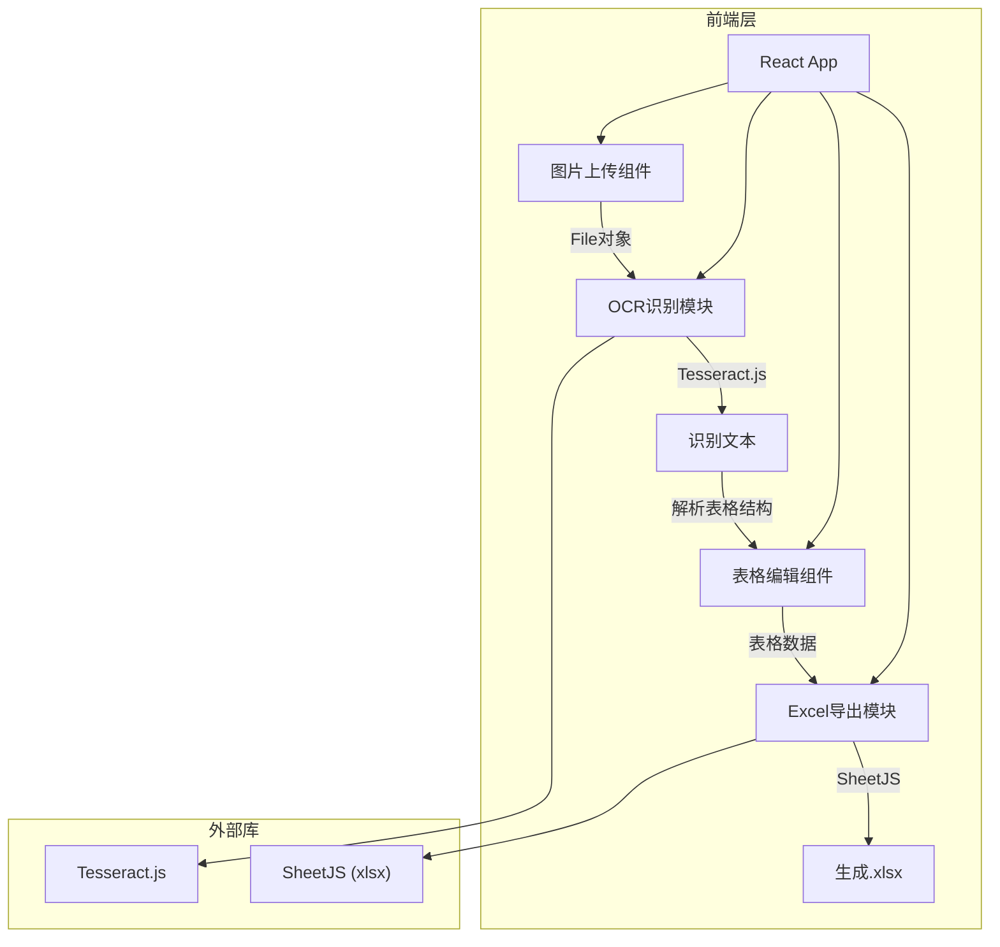

## 1. 架构设计



## 2. 技术说明

- 前端：React@18 + TypeScript + Tailwind CSS + Vite
- 初始化工具：vite-init
- OCR引擎：Tesseract.js（纯浏览器端OCR，支持中英文识别）
- Excel生成：SheetJS (xlsx)（纯浏览器端生成.xlsx文件）
- 状态管理：Zustand
- 后端：无（纯前端项目）
- 数据库：无

## 3. 路由定义

| 路由 | 用途 |
|------|------|
| / | 主页面（上传→识别→编辑→导出全流程） |

## 4. 核心模块设计

### 4.1 图片上传模块 (ImageUploader)

- 支持拖拽上传和点击选择
- 文件类型校验（JPG/PNG/BMP）
- 文件大小校验（≤10MB）
- 上传后生成预览URL
- 拖拽进入时视觉反馈

### 4.2 OCR识别模块 (OCRProcessor)

- 使用Tesseract.js进行文字识别
- 支持中文(chi_sim)和英文(eng)语言包
- 实时进度回调（加载语言包进度 + 识别进度）
- 识别结果文本解析为二维数组（表格结构）
- 表格结构解析策略：
  1. 按换行符分割行
  2. 按制表符/多空格分割列
  3. 自动对齐列数

### 4.3 表格编辑模块 (TableEditor)

- 可编辑的HTML表格
- 单元格双击进入编辑模式
- 支持增加/删除行和列
- 支持清空所有数据
- 斑马纹行样式
- 行号显示

### 4.4 Excel导出模块 (ExcelExporter)

- 使用SheetJS将二维数组转为工作簿
- 设置列宽自适应
- 生成.xlsx文件并触发浏览器下载
- 文件名包含时间戳

## 5. 项目文件结构

```
src/
├── components/
│   ├── ImageUploader.tsx    # 图片上传拖拽区
│   ├── ImagePreview.tsx     # 图片预览面板
│   ├── OCRProgress.tsx      # OCR识别进度条
│   ├── TableEditor.tsx      # 可编辑表格
│   ├── Toolbar.tsx          # 工具栏（增删行列、导出）
│   └── EmptyState.tsx       # 空状态引导
├── hooks/
│   └── useOCR.ts            # OCR识别Hook
├── lib/
│   ├── ocr.ts               # Tesseract.js封装
│   ├── parser.ts            # 表格结构解析
│   └── exporter.ts          # Excel导出封装
├── store/
│   └── appStore.ts          # Zustand全局状态
├── pages/
│   └── HomePage.tsx         # 主页面
├── App.tsx
└── main.tsx
```

## 6. 状态管理设计

```typescript
interface AppState {
  imageFile: File | null
  imagePreviewUrl: string | null
  ocrStatus: 'idle' | 'loading' | 'recognizing' | 'done' | 'error'
  ocrProgress: number
  tableData: string[][]
  setImageFile: (file: File | null) => void
  setOcrStatus: (status: OcrStatus) => void
  setOcrProgress: (progress: number) => void
  setTableData: (data: string[][]) => void
  updateCell: (row: number, col: number, value: string) => void
  addRow: () => void
  addColumn: () => void
  deleteRow: (index: number) => void
  deleteColumn: (index: number) => void
  reset: () => void
}
```
